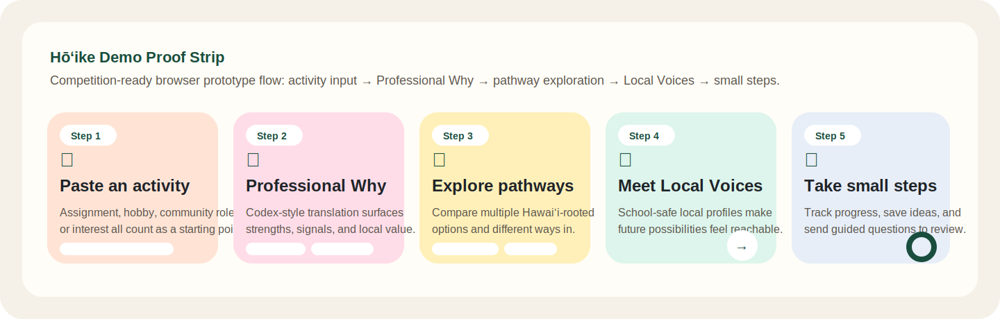

# Hōʻike Challenge Package

Hōʻike Explorer is a Codex-built browser prototype for the OpenAI x Handshake Codex Creator Challenge. It is designed for HIDOE middle and high school students and demonstrates how OpenAI Codex can translate assignments, hobbies, and community activities into local pathway exploration, safer professional discovery, and concrete next steps.

This workspace contains the full submission package:

- `submission/hoike-proposal.md` - the polished proposal
- `submission/hoike-executive-summary.md` - the judge-friendly executive brief
- `submission/hoike-demo-script.md` - a 3-minute finalist demo script
- `submission/handshake-ai-showcase.md` - submission-ready Handshake AI Showcase copy
- `submission/hoike-founder-brief.md` - a founder-style launch memo for judges
- `submission/competition-checklist.md` - packaging checklist for the challenge
- `demo/index.html` - a lightweight MVP walkthrough
- `demo/extension-mockup.html` - a near-term Chrome extension direction on top of a Canvas-like page
- `demo/styles.css` - demo styling
- `demo/app.js` - demo interactions and translation logic
- `AGENTS.md` - project guidance for future Codex iterations
- `submission/demo-proof-strip.svg` - lightweight visual proof artifact for the core product flow

## What Hōʻike Solves

Hawaiʻi students do not only need lists of jobs. Many also need help with the hidden curriculum of career navigation: seeing how what they already do connects to local futures, understanding different ways into a field, and getting low-stakes support for first questions. Hōʻike is designed to reduce those informational frictions inside a workflow students already understand.

## What OpenAI Codex Is Doing

In the demo, Codex is represented as the reasoning layer that:

- reads an assignment, activity, or interest
- infers strengths and signals from that starting point
- maps those signals into Hawaiʻi-relevant pathway options
- surfaces school-safe Local Voices and guided next steps
- exposes that reasoning in the `AI Translation Log` for reviewers

The repo and UI are intentionally built to make that execution visible, not hidden behind static copy.

## Extension Direction

The main hosted demo is the primary judged artifact, but the extension mockup shows the near-term implementation direction. In a real Chrome extension build, Hōʻike should mount its sidebar inside a dedicated root using `Shadow DOM` so Canvas styles cannot break the overlay and the overlay cannot interfere with LMS rendering.

## Why Hawaiʻi

Hōʻike is explicitly Hawaiʻi-centered. The product frames local futures as contribution to home, community, and local resilience, not just as a pipeline to employment or a reason to leave. The explainer mode and submission package connect the prototype to Hawaiʻi-specific brain drain, hidden curriculum, and pathway-decision research.

## What Judges Should Notice

- `Execution`: the main demo includes a paste-any-activity flow and an `AI Translation Log` that makes the Codex-guided reasoning legible even when hosted as a static browser prototype.
- `Usefulness / Value`: the product focuses on a real workflow problem for Hawaiʻi students by reducing informational frictions around pathway exploration, Local Voices discovery, and safer first questions.
- `Polish / Thoughtfulness`: the prototype includes pseudonymous student handles, moderated question flows, cohort-aware classroom signals, and concrete `Do Now / Try This Week / Explore Next` follow-up steps.

## Built With Codex

This project was developed using a vibe-coding workflow: natural-language prompting and iterative guidance with an AI coding assistant to generate, refine, and debug the prototype. That workflow was especially useful for:

- building the browser-based demo flow quickly
- iterating on CSS and interaction details across both the main demo and extension mockup
- wiring activity translation outputs into pathway, Local Voices, prompt, and progress UI
- making the experience feel native to a student workflow inspired by Canvas

## Demo Notes

- The main hosted demo is the primary judged artifact.
- The extension mockup is a high-fidelity product-direction surface, not a production Canvas extension.
- The `AI Translation Log` is intentionally visible in the main demo so reviewers can see how the assignment-to-pathway reasoning works.
- `Local Voices` profiles are simulated for presentation purposes.
- The public ship target should open directly to `demo/index.html`, with `demo/extension-mockup.html` as the secondary artifact.

Live demo: [https://gfujii808.github.io/Ho-ike/](https://gfujii808.github.io/Ho-ike/)

Direct main demo: [https://gfujii808.github.io/Ho-ike/demo/index.html](https://gfujii808.github.io/Ho-ike/demo/index.html)

Extension mockup: [https://gfujii808.github.io/Ho-ike/demo/extension-mockup.html](https://gfujii808.github.io/Ho-ike/demo/extension-mockup.html)
